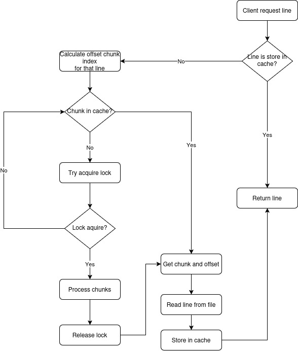

# Setup and Run

First run the setup script.
This will install all the necessary dependencies.

    ./script/build.sh
Then star the server by running, whose file_path is the name of the file to serve

    ./script/run.sh <file_path>

# How does your system work?
### 1. Calculating and Storing Offsets
The main goal is to avoid reading large files completely on each request. To do this, I use **offsets**, which represent the starting positions of each line in the file. The process for generating and storing these offsets is as follows:

- **Reading the File**: The file is read line by line, and for each line, the **byte index** (offset) where it begins in the file is recorded. This index is added to an array of offsets.
- **Storage Structure**: The offsets array is divided into **chunks**. Each chunk contains, for example, 1000 offsets. These chunks are stored in the Redis cache, allowing efficient offset fetching.

### 2. Reading Lines Using Offsets
- **Offset Access**: When a line is requested, I calculate in which chunk the line index is present. The corresponding chunk is then fetched from the cache.
- If the chunk is already stored in the cache, it is loaded into memory.
- Otherwise, the file is read from the last processed chunk to the end of the requested chunk, minimizing the amount of unnecessary reading.
- **Cache Fetching**: When the offset chunk is found in the cache, the index of the desired line is retrieved from the offset array. From that position, the line is read from the file and returned to the client.

### 3. Concurrency Management and Locks
- **Locks** are used to ensure that chunk generation is not done simultaneously by different processes. When a chunk is not present in the cache, an **exclusive lock** is acquired to ensure that only one process generates the chunk. 
- **Locking and Retry Strategy**: If another process is generating the requested chunk, the process enters a **retry** cycle, waiting for the lock to be released or for the writing process to be completed in the cache.

### 4. Storing Content in the Cache
- The content of the lines is also stored in the Redis cache. I use the line index as the key to store the content, which facilitates the efficient search for the line in the cache in subsequent requests.
- **Avoiding Repeated Processing**: By storing the lines in the cache, we avoid reading and processing the file repeatedly, saving computational resources.

### 5. Preprocessing

- When the server starts, a background job is executed to process the file. This allows part of the file to already have been processed and the offsets stored in the cache when the first request is made.

### 6. Practical Example
Considering the file with the following content:

	Line 1
	Line 2
	Line 3
	...
	Line n

The file has the folling bytes

	Line 1\nLine 2\nLine 3\n...\nLine n\n

And the offsets calculated as 

    [0, 7, 14, ...]

- **Request for Line 1** (index 1): The system verifies that line 1 is in **chunk 0** and retrieves offset `7`. From this position, the file is read and the line "Line 2" is returned.
- The content of line 1 is stored in the cache for future requests.

### The following diagram should help you better understand the flow:

# How will your system perform with a 1 GB file? a 10 GB file? a 100 GB file?
File size has less impact than the number of lines. As long as each line fits into memory, the system should not encounter issues when reading the file.
Performance remains efficient due to Redis caching, which minimizes repeated file reads, and the chunking mechanism, which divides the file into manageable segments. This ensures that only relevant portions of the file are loaded into memory at any given time.
However, the system's performance is ultimately constrained by the available Redis cache size. As the file grows and the number of lines increases, performance may degrade, particularly when early requests target high-index lines that haven't been cached yet.
Proper Redis memory management and fine-tuning of cache eviction policies will be essential to maintain responsiveness, especially as the dataset scales. These strategies may include caching only direct entries for the most frequently requested lines, reducing memory consumption while maintaining fast access to critical data.

# How will your system perform with 100 users? 10000 users? 1000000 users?
The system should support many concurrent users with ease, as Redis is designed for high concurrency. 
The caching mechanism will prevent file readings, ensuring fast access even under high load. Additionally, I am using Puma, a multi-threaded and multi-process web server, which efficiently handles concurrent requests by leveraging multiple CPU cores.
As the number of clientes scale to the millions, Redis migth become bottleneck, especially if many users request different lines from the file simultaneously.
To support this load, tuning up the chunks or even horizontal scaling of Redis and sharding may be necessary.

# What documentation, websites, papers, etc did you consult in doing this assignment?

- https://stackoverflow.com/a/71446651/10577482 (offsets idea)
- https://ruby-doc.org/core-2.5.5/IO.html#method-i-seek
- https://guides.rubyonrails.org/caching_with_rails.html

# What third-party libraries or other tools does the system use? How did you choose each library or framework you used?

1. **Redis and Rails Cache:**
    - **Purpose:** Used for caching line offsets and file content to redure disk reads and leverage Rails's build-in caching system
    - **Why Chosen:** Redis is a high-performance in-memory key-value store, capable of handling large amounts of data.
2. **Puma**
    - **Purpose:** Web server that efficiently handle multiple concurrent requests.
    - **Why Chosen:** optimized for multi-threaded applications and integrates well with Rails
3. **Swagger** (Rswag)
    - **Purpose:** Used to generate API documentation and enable API testing via an interactive UI.
    **Why Chosen:** Simplifies API documentation. It also allows testing directly from the Swagger UI.

# How long did you spend on this exercise? If you had unlimited more time to spend on this, how would you spend it and how would you prioritize each item?
### Time Spent
Tis exercise took one weekend to complete. This includes setting up the development environment, troubleshooting configuration problemas, investigation, development, debugging and test.

### If had unlimited more time
- **Optimizing Redis Usage:** I would explore more advanced Redis configurations and possibly introduce Redis sharding
- **Handling Large Files More Efficiently**: I would investigate using a distributed file system like Amazon S3 to store large files and integrate the system with a scalable file storage solution. This would allow parallel reads, reducing the load on a single node and splitting the file into chunks stored across multiple machines.
- **Advanced Caching Strategies:** Fine-tuning cache eviction policies by keeping stored only the most requently requested lines, reducing the size of Redis.

# If you were to critique your code, what would you have to say about it?

### Positive Aspects
- The code is modular and follows a clear flow for chunking, reading, and caching.
- Low memory use
- The lock mechanism ensures that chunks are only processed once, avoiding redundant work.
- Reading the file only one time
- Preprocessing the file to speedup the first requests

### Areas for Improvement
- **Error Handling:** There could be better error handling, especially for file reading errors.
- **Scalability:** Although the system uses chunking, further optimizations are needed for very large files and user loads (e.g., Redis scaling).
- **Testing and Robustness:** Additional unit tests and performance benchmarks could be added to ensure the system scales effectively with large files and many users.